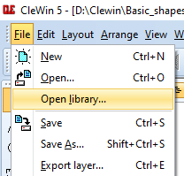
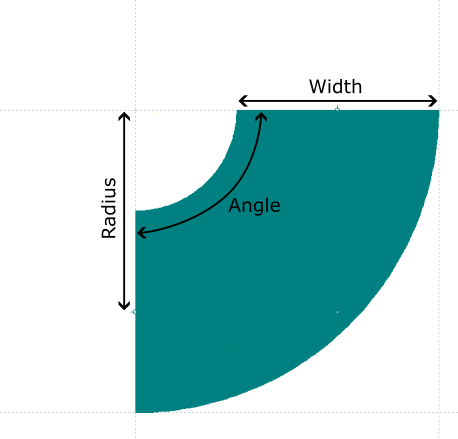
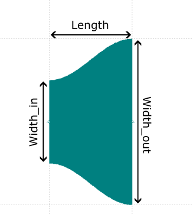
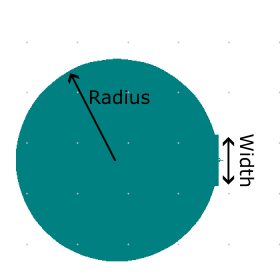

# Manual for basic shapes in CleWin
By Lars Kool, Plateforme Technologique d'Institut Pierre-Gilles de Gennes

## Purpose of this repository

CleWin is a layout editor for lithography masks developed and maintained by WieWeb software (in collaboration with the MESA+ Institute at the University of Twente). CleWin is hierarchical, i.e. each layer/design consists of objects/patterns (called "symbols") that can themselves consist of different symbols (see picture below). Changes made to symbols low in the hierarchy are propagated to the upper layers, so making small changes is easier.


With CleWin you can place centimeter sized object with nanometric accuracy. But with this power comes great responsibility. It is the designers responsability to make sure that all symbols are properly aligned, and there are no gaps (any gap could, depending on the resolution of your fabrication method, end up in your mask. See for instance the small gap between the circle and a rectangular channel due to misalignment).


To help with this, CleWin has a scripting interface that allows users to program the layout of a symbol in C, Matlab, MaskEngineer, Lua or Python. While this is incredibly powerful, it does bring a high barrier to entry. Moreover, CleWin only supports lines, polygons, circles, and circular arcs. Any other shape has to be aproximated by a polygon using the scripting interface. Furthermore, CleWin allows you to place snapping nodes (including normal vector) in your symbols to ensure perfect alignment, but only using the scripting interface.


This repository (i.e. GitHub folder) aims to bridge the gap between the use of only natively supported shapes, and full on scripting your entire design, by providing a library of parametric symbols (i.e. symbols that can be changed by changing the input parameters) commonly found in microfluidics. This is far from an exhaustive list. If you think a commonly used symbol/shape is missing, feel free to open a request [here](https://github.com/Lars-Kool/CleWin_IPGG/issues).

## Installation and updates

### Installation

"Installation" of this library is very simple, here we will guide you through the process.
1. First download the repository either by clicking the the green **Code** button, followed by "Download ZIP", and then unzipping the folder, or by cloning the repository `git clone https://github.com/Lars-Kool/CleWin_IPGG` in a folder of your choosing (need to have [**Git**](https://www.git-scm.com/) installed).
2. Next add the library to CleWin by clicking "**File->Open Library**", and selecting the "Basic_shapes.cif" file in the folder you just downloaded.



### Updates

CleWin reloads the library file on startup, meaning that replacing the "Basic_shapes.cif" file with 'update' the library. The method of replacing the library depends on the method of installing the original library. If you manually downloaded and unzipped the library, you need to do this again, and replace the old folder with the new folder.
Updating the library using Git is much simpler, just run `git pull`, and the library will be updated automatically!

## Adding and modifying symbols in CleWin

Added libraries can be found at the right side of the screen. We would recommend pinning the library interface, since we expect you to use it frequently. Adding a symbol from the library is as simple as dragging the label of the symbol into your design. If you are not able to find a symbol described below in the list, make sure that you expanded all symbols. Some symbols can be hidden as subsymbols. Note the semi-circles with a line through them at the edge of the symbols. These are snap-nodes (with the direction indicated by the line). Dragging two symbols with lines snap-nodes close to to each other will cause the symbol to snap to the already present symbol and automatically rotate in the correct orientation. This will prevent any misalignment of the components.


Most likely the default size of the symbol does not match your desired size. You can change the parameters (which are detailed per shape below) two ways. You can change the parameters of a specific symbol instance by selecting it followed by 'right-click' and selecting properties (or by pressing 'Alt'+'Enter' after selecting it). You can also change the default parameters of that symbol in your design using 'right-click'->'Properties'in the symbols menu. This automatically changes the parameters of all instances which have the default parameters.

Properties to change the parameters of the symbol" width=300px/>

The location of the snap-nodes is calculated automatically upon changing the parameters, ensuring the design is always properly aligned. Should you find a case where the snap-node is not properly aligned, please open a ticket [here](https://github.com/Lars-Kool/CleWin_IPGG/issues).

It is very likely that you will use a specific combination of basic symbols multiple times in your design. The hierarchical nature of CleWin allows you to create a new symbol ('Arrange'->'Create Emtpy Symbol'). You can then place this more complex symbol in your design, without having to place and align all the sub-symbols.

## Selecting symbols

By default, you can select symbols by clicking on an edge, node, or by drawing a box around it. However, this can be challenging when symbols are touching. There is, however, a setting that can greatly simplify selecting specific symbols. Under "Layout->Preferences->Selecting objects" set "By clicking on..." to "Nodes, edges and interior". You can now select a specific symbol by clicking inside the channel. To select multiple symbols, just hold "Shift" and click each symbol. 


# Advanced methods

There might be a time where you would like to do more advanced things, like have a channel follow a non-linear/circular path, add parameters to your complex symbol and have them propagated to the sub-symbols, or add a matrix of labels to your mask, for example. Sadly, you have reached the limit of this library, and you will have to venture in the world of scripting. The CleWin UserGuide (which can be found in the install folder of CleWin) has all the necessary documentation. Furthermore, feel free to have a look at the scripts in the 'src' folder to see you we created certain objects. **MAKE SURE THAT YOU SAVE YOUR SYMBOLS TO A DIFFERENT FILE!!!** Whenever you update this library, the file will be overwritten, and you will lose all your symbols. There is basically no way to get them back!

A couple tips on scripting (in C) that were not immediately obvious to me:
- When creating a polygon, you need an array of nodes. The expected format is double nodes[] = {x1, y1, x2, y2, ..., xn, yn}.
- If you want to modify a TransformationMatrix (TM), the operations need to be done in the following ISRT:
    1. Identity (unityTM)
    2. Scale (scaleTM)
    3. Rotate (rotateTM)
    4. Translate (translateTM)
- If you want to transform a symbol, you need to perform all the transformations **before** adding the object.
- The functions `snapnode()` and `rotateTM()` require the angle in degrees, whereas all the math functions require the angle in radians.

# Symbol descriptions

Below are the descriptions of the basic shapes included in the library, including the parameters that define them. All parameter ranges are given in micrometers, unless stated otherwise. **It is possible that some of the shapes are not visible, that is because CleWin includes them as sub-symbols of other symbols. Make sure you have all symbols expanded**
Also, symbols will not be drawn on the currently active layer. Rather, they will be drawn on the layer indicated by the index-parameter "Layer", which should be an integer (non-integers will be rounded down). I have not found a convenient way to change the layer of a group of symbols, so make sure you set the Layer correctly. Note, if the provided layer index does not exist, it will be created automatically.

## Straight

A straight line piece of constant width. Snapnodes are placed along the centerline.
- Width :   Width of the channel (5 <= Width <= 10000)
- Length:   Lenght of the channel (5 <= Width <= 10000)
- Layer:    Index of the layer (0 <= Layer <= 255)


## Corner_sharp

A sharp corner with constant width of the in and outgoing channel. Snapnodes are placed at the centerline of the in- and outgoing channel.
- Width:    Width of the channel (5 <= Width <= 10000)
- Angle:    Angle of the corner (-90 <= Angle <= 90)
- Layer:    Index of the layer (0 <= Layer <= 255)


## Corner_smooth

A smooth corner with constant width, snapnodes are placed along the centerline of the in- and outgoing channel.
- Width:    Width of the channel (5 <= Width <= 10000)
- Angle:    Angle of rotation of the bend (-180 <= Angle <= 180, in degrees).
- Radius:   Radius of the centerline of the bend (5 <= Radius <= 10000 and Radius >= Width/2)
- Layer:    Index of the layer (0 <= Layer <= 255)



## Constriction_sharp

A linear transition between two channel widths. Note that the output can also be wider than the input! Snapnodes are placed along the centerline.
- Length:   Length of the transition (5 <= Length <= 10000)
- Width_in: Width of the ingoing channel (5 <= Width_in <= 10000)
- Width_out:    Width of the outgoing channel (5 <= Width_out <= 10000)
- Layer:    Index of the layer (0 <= Layer <= 255)


## Constriction_smooth

A smooth transition between two channel widths. Note that the output can also be wider than the input! Snapnodes are placed along the centerline.
- Length:   Length of the transition (5 <= Length <= 10000)
- Width_in: Width of the ingoing channel (5 <= Width_in <= 10000)
- Width_out:    Width of the outgoing channel (5 <= Width_out <= 10000)
- Layer:    Index of the layer (0 <= Layer <= 255)



## InOutlet

In- outlet. The circular area has a flat side to match the channel width. The snapnode is placed in the center of the flat side.
- Radius:   Radius of the in/outlet (5 <= Radius <= 10000)
- Width:    Width of the in/outgoing channel.
- Layer:    Index of the layer (0 <= Layer <= 255)



## Mask

Outline for the mask. After drawing your design in the center, you can select everything and invert it (Ctrl+F11) to yield your mask. Since binary operations are not supported in scripting in our version (only from 5.4 onwards), this mask only works for a mask for a 4" wafer (~10 cm diameter).


## T-junction

Rectangular piece with 3-snapnodes, centered along 3 of the 4 sides of the rectangle.
- Width:    Width of the rectangle (5 <= Width <= 10000)
- Length:   Length of the rectangle (5 <= Length <= 10000)
- Layer:    Index of the layer (0 <= Layer <= 255)


## X-junction

Rectangular piece with 4 snapnodes, one centered on each of the 4 sides.
- Width:    Width of the rectangle (5 <= Width <= 10000)
- Length:   Length of the rectangle (5 <= Length <= 10000)
- Layer:    Index of the layer (0 <= Layer <= 255)


## Y-junction_sharp

Y-junction, where both the angle and width of the output channels can be controlled separately. Snapnodes are placed at the center of the input channel, and the two output channels. Note: internally the biggest output will be placed on top to simplify the calculations. Should you want it on the bottom, you will have to mirror it, switching the output widths does not work.
- Width_in:     Width of the input channel (5 <= Width_in <= 10000)
- Width_out_1:  Width of the widest output channel (5 <= Width\_out\_1 <= 10000)
- Width_out_2:  Width of the widest output channel (5 <= Width\_out\_2 <= 10000)
- Angle_1:      Angle of the widest output channel (0 <= Angle\_1 <= 90)
- Angle_2:      Angle of the widest output channel (0 <= Angle\_2 <= 90)
- Layer:    Index of the layer (0 <= Layer <= 255)


## Y-junction_smooth

Y-junction, where both the angle and width of the output channels can be controlled separately. Snapnodes are placed at the center of the input channel, and the two output channels.
- Width_in:     Width of the input channel (5 <= Width_in <= 10000)
- Width_out_1:  Width of the widest output channel (5 <= Width\_out\_1 <= 10000)
- Width_out_2:  Width of the widest output channel (5 <= Width\_out\_2 <= 10000)
- Angle_1:      Angle of the widest output channel (0 <= Angle\_1 <= 90)
- Angle_2:      Angle of the widest output channel (0 <= Angle\_2 <= 90)
- Layer:    Index of the layer (0 <= Layer <= 255)


## Split_N1_N2

Straight section that splits N1 inputs into N2 outputs.
- Length:   Length of the straight section (5 <= Length <= 10000)
- Width:    Width of the straight section (5 <= Width <= 10000)
- N1:       Number of inputs (1 <= N1 <= 100)
- N2:       Number of outputs (1 <= N2 <= 100)
- Layer:    Index of the layer (0 <= Layer <= 255)


## U-bend_smooth

U-bend, can be combined into a serpentine channel (also see next symbol). Snapnodes are placed at the centerline of the channel. Note that this symbol is designed as a sub-symbol for a serpentine channel (see next symbol). As such, The actual height is less than the "Height" parameter, as it is expected that a Corner_smooth (```Width=Width, Radius=(Width+Spacing)/2, Angle=90```) is used to connect the U-bend to the circuit (see the dashed corner). Hence, the actual height is ```Height - Radius```
- Width:    Width of the channel (5 <= Width <= 10000)
- Height:   Height of the U-bend (5 <= Height <= 10000)
- Radius:   Radius of the centerline of the bend (5 <= Radius <= 10000)
- Layer:    Index of the layer (0 <= Layer <= 255)


## Serpentine_N

Serpentine channel with U-bend_smooth corners. Snapnodes are placed at the centerline of the channel. The in- and output of the channel are placed off-center, such that a Corner_smooth (Width=Width, Radius=(Width+Spacing)/2, Angle=90) can be used to connect the serpentine to the circuit (see the dashed corners).
- Width:    Width of the channel (5 <= Width <= 10000)
- Height:   Height of the serpentine, centerline to centerline (5 <= Height <= 10000)
- Radius:   Radius of the centerline of the bend (5 <= Radius <= 10000)
- N:        Number of U-bends (1 <= N <= 100)
- Layer:    Index of the layer (0 <= Layer <= 255)


## Serpentine_L

Serpentine channel with given length and length of the centerline. The number of bends is calculated using the provided Width and rounded up. The number of bends is then used to calculate the actual Width of the serpentine. The actual Width will thus always be slightly smaller than the provided Width.

```N = ceil((Length-Length_path+Radius*(PI-2))/(4*Radius-PI*Radius-Height))```

```Height = -(Length-Length_path+Radius*(PI-2))/N + 4*Radius - PI*Radius```

- Width:    Width of the channel (5 <= Width <= 10000)
- Height:   Height of the serpentine, U-bend to U-bend (4*Radius <= Height <= 10000)
- Radius:   Radius of the centerline of the bend (5 <= Radius <= 10000)
- Length:   Length of the section (5 <= Length <= 10000)
- Length_path:  Length of the centerline (Length + (2*PI-4)Radius <= Length_path <= 10000)
- Layer:    Index of the layer (0 <= Layer <= 255)


## Shift_smooth

Smoothly shifting the channel up/down by a (center-to-center) distance of Height, over a distance Length of a channel of size Width using a curvature of radius Radius.

- Width:    Width of the channel (5 <= Width <= 10000)
- Height:   Vertical displacement (5 <= Height <= 10000)
- Length:   Horizontal displacement (5 <= Length <= 10000)
- Radius:   Radius of curvature (5 <= Radius <= 10000)
- Layer:    Index of the layer (0 <= Layer <= 255)


## Herringbones

Creates an array of herringbone channels for mixing. Note that the snapping works across layer!

- Width:    Width of the channel (5 <= Width <= 10000)
- Width_herringbone:    Width of the herrinbone (5 <= Width_herringbone <= 10000)
- Spacing:  Distance between the herringbones (5 <= Spacing <= 10000)
- N_per_group:  Number of herrinbones in a group, i.e. cluster with the same orientation (1 <= N_per_group <= 100)
- N_groups: Number of groups, each group is a mirror along x of the previous group (1 <= N_groups <= 100)


